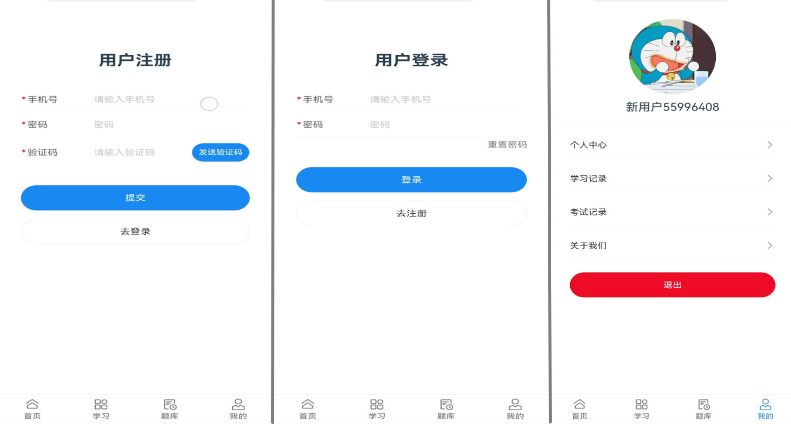

# UCloudTeach-Student

### 项目介绍
本仓库为优云教在线教育平台学生侧前端项目，技术栈为 Vue3+Vant3+TypeScript ，使用 postcss-pxtorem 将单位从 px 转化为 rem，以适配移动端的样式/大小，使用 lib-flexible 设置 rem 基准值。具体转换规则可见 postcss.config.js 文件，其他依赖组件信息可见 package.json 文件。

项目功能描述可见后端仓库：[UCloudTeach-Monolithic](https://gitee.com/h0ss/ucloud-teach-monolithic)，项目学生端基本交互功能都已实现，简单的场景示例如下：

首页-课程-题库：

注册-登录-个人中心：

课程简介-目录-评论-详情：

课后练习：

考试OR练习：

学习记录-考试记录：

### 使用说明

1.  克隆本仓库：git clone https://github.com/hossking/UCloudTeach-Student.git
2.  安装依赖：npm install
3.  运行项目：yarn run serve-dev
4.  确保后端项目已启动，修改.env.dev文件中的地址与端口信息
5.  本地构建请在浏览器访问http://localhost:8081
